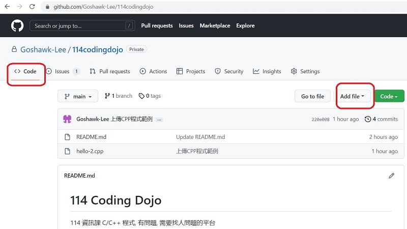
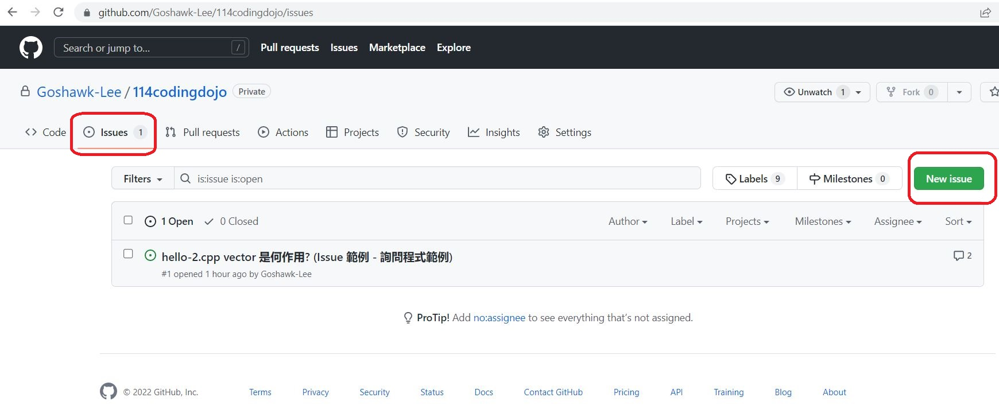

# 114 Coding Dojo
114 資訊課 C/C++ 程式, 有問題, 需要找人諮詢問題的平台 (要先申請權限,才能問問題) 
Repo owner : goshawk.lee@hotmail.com , 申請權限 e-mail to owner 

 Steps :  
1. 先在 "<> Code" 分頁, 上傳程式 [<>Code] 分頁 -> [Add file] -> [Upload files] 
<picture>

</picture>  
2. 上傳完成後, 點選該程式, 複製該程式的網址 e.g. : https://github.com/Goshawk-Lee/114codingdojo/blob/main/hello-2.cpp  
3. 再到 "O Issues" 分頁,  建立新的 issue 輸入問題內容 (附上該程式的網址) , [O Issues] 分頁 -> [New issue]  
  
<picture>

</picture> 
4. 同一問題 , 會在同一 issue 內討論, 直到 close 為止   
