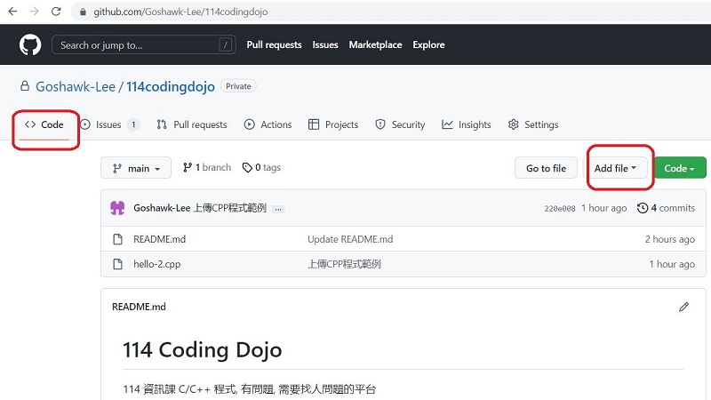
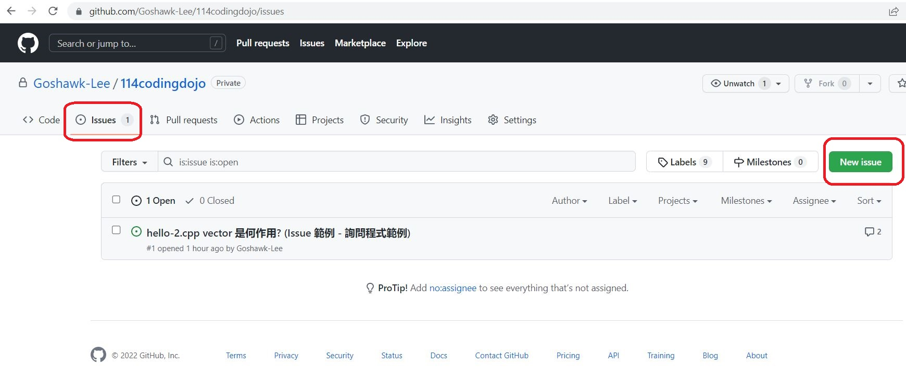

# 114 Coding Dojo
114 資訊課 C/C++ 程式, 有問題, 需要找人諮詢問題的平台, 但要先 [申請GitHub帳號](https://how-to-make-docs.readthedocs.io/zh_TW/latest/GoogleDoc/Github%E5%B8%B3%E8%99%9F%E7%94%B3%E8%AB%8B.html), 再申請權限, 才能上傳自己的程式, 建立新的 issue 問問題。 
Repo owner : goshawk.lee@hotmail.com , 申請好GitHub帳號, e-mail 自己的GitHub帳號給 owner, 申請權限, 或直接先用 e-mail 問問題。
 
###### 諮詢問題 Steps :

1. 先在 "<> Code" 分頁, 上傳程式 [<>Code] 分頁 -> [Add file] -> [Upload files] 
<picture>

</picture>  
2. 上傳完成後, 點選該程式, 複製該程式的網址 e.g. : https://github.com/Goshawk-Lee/114codingdojo/blob/main/hello-2.cpp  
3. 再到 "O Issues" 分頁,  建立新的 issue 輸入問題內容 (附上該程式的網址) , [O Issues] 分頁 -> [New issue]  
<picture>

</picture> 
4. 同一問題 , 會在同一 issue 內討論, 直到 close 為止   
